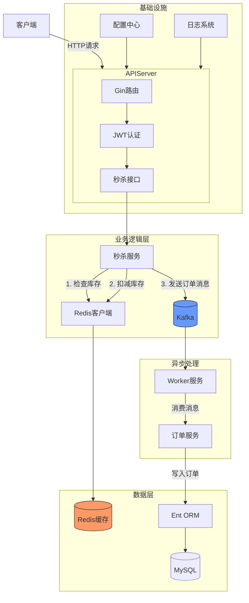

# flash-deal
A high-performance e-commerce MVP focusing on flash-sale (seckill) scenarios, built in Go.

## 💼 Commercial Use

This project is released under the MIT License and free to use.  
If you're interested in using FlashDeal in a commercial setting or need custom features, feel free to contact me for licensing or consulting:

📧 Email: algorithm9@163.com

## 架构图

### 架构说明：

1. 客户端层 ：Web/App客户端通过HTTP请求访问API服务
2. API服务层 ：基于Gin框架实现，包含路由和JWT认证中间件
3. 业务模块 ：分为用户、秒杀、商品三大核心服务，采用仓储模式设计
4. 数据层 ：使用Ent ORM操作MySQL数据库，Redis用于秒杀库存缓存
5. 基础设施 ：包含配置中心、日志系统和Kafka消息队列
6. Worker服务 ：独立部署的消费者服务，处理Kafka中的异步任务
   秒杀核心流程：用户请求 → API层 → 秒杀服务 → Redis扣减库存 → 发送订单消息到Kafka → Worker消费消息完成订单入库